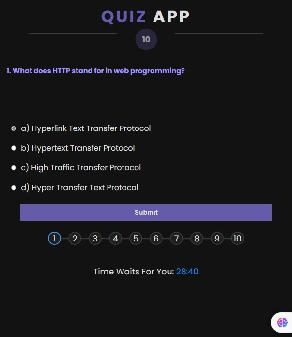

# Simple_Js_Tasks-6
## Quiz Application

## Table of Contents
- [Overview](#overview)
- [Features](#features)
- [Demo](#demo)
- [Technologies Used](#technologies-used)
- [Project Structure](#Project-Structure)
- [Contributing](#contributing)
- [Author](#Author)
- [License](#license)

## Overview
A web-based quiz application built using HTML, CSS, and JavaScript. It fetches questions and options from a JSON file and allows users to answer questions within a time limit. The application tracks scores and displays results at the end.
## Features

- **Fetch Questions**: Questions are fetched from a JSON file (`data.json`) asynchronously.
- **Display Questions**: Displays each question sequentially with multiple-choice options.
- **Score Tracking**: Tracks the user's score based on correct answers.
- **Progress Tracking**: Shows progress through a progress bar and question bullets.
- **Countdown Timer**: A countdown timer shows remaining time to complete the quiz.
- **Responsive Design**: Designed to work on various screen sizes (desktop, tablet, mobile).

## Demo

- You can Try out the App online [**From Here**](https://eng-ahmed-hussien.github.io/Simple_Js_Tasks-6/)

## Technologies Used

- **HTML**: Structure of the application.
- **CSS**: Styling the application for visual appeal and responsiveness.
- **JavaScript**: Functionality and interactivity of the quiz.
- **Fetch API** for data retrieval
- **JSON** for storing quiz data
- **Font Awesome**: Used for icons.
- **Google Fonts**: Imported for the Poppins font family.

## Project Structure

- `index.html`: HTML structure of the application.
- `assets/css/main.css`: CSS file for styling.
- `assets/js/main.js`: JavaScript file for functionality.
- `assets/js/data/data.json`: JSON file containing quiz questions and answers.

## Contributing

Contributions are welcome! Fork the repository and submit a pull request.

## Author

- [Ahmed Hussien](https://github.com/Eng-Ahmed-Hussien)

## License

This project is licensed under the MIT License - see the [LICENSE](LICENSE) file for details.

